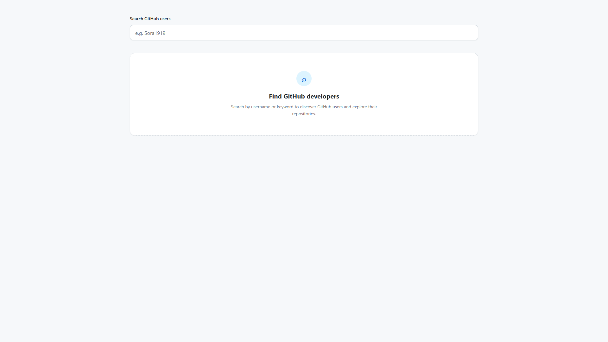
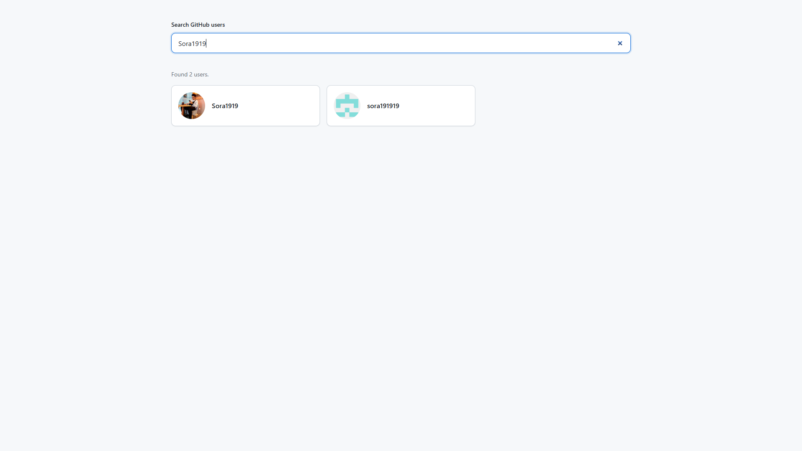
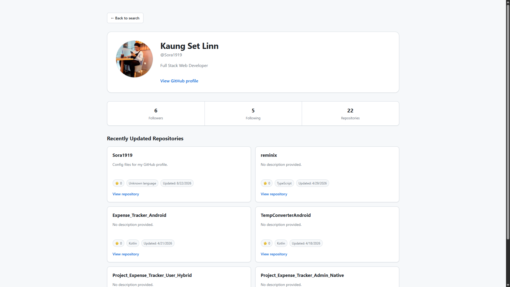

# GitHub User Search

A responsive GitHub user search application built with React, TypeScript, and the GitHub REST API.

Search for GitHub users, explore their profiles, and view their recently updated public repositories.

## Features

- Search GitHub users
- 400ms search debounce
- GitHub user avatars and usernames
- Detailed user profiles
- Followers, following, and public repository statistics
- Recently updated repositories
- Repository stars and programming languages
- Direct links to GitHub profiles and repositories
- Loading states
- Error states
- Empty states
- 404 handling
- Responsive design
- Accessible keyboard interactions
- Request cancellation with AbortController

## Tech Stack

- React
- TypeScript
- Vite
- GitHub REST API
- CSS
- Fetch API

## React Concepts

This project demonstrates:

- Functional components
- Component composition
- State lifting
- Controlled inputs
- Custom hooks
- Generic TypeScript
- Discriminated unions
- Typed API responses
- Conditional rendering
- Async data fetching
- AbortController
- Responsive CSS
- Container/Presentational component separation

## Project Structure

```text
src/
├── components/
│   ├── ProfileView.tsx
│   ├── RepoCard.tsx
│   ├── RepoList.tsx
│   ├── SearchBox.tsx
│   ├── UserCard.tsx
│   ├── UserList.tsx
│   └── UserProfile.tsx
│
├── hooks/
│   ├── useDebounce.ts
│   └── useFetch.ts
│
├── types/
│   └── github.ts
│
├── App.tsx
└── main.tsx

```

## Screenshots

### Search 



### Search Result



### View User Profile



## Getting Started

### Prerequisites

- Node.js
- npm

## Installation
Clone the repository

```
git clone <your-repository-url>
```

Navigate into the project:
```
cd github-search-app
```

Install dependencies:
```
npm install
```

Start the development server:
```
npm run dev
```

Open the local URL provided by Vite.

## Build
Create a production build:
```
npm run build
```

Preview the production build:
```
npm run preview
```

## API
This project uses the public GitHub REST API.

The application uses endpoints for:

- User search
- User profiles
- User repositories

No GitHub authentication token is required for the current version.

## Future Improvements
Possible future improvements include:

- Pagination
- Search filters
- Repository language filtering
- GitHub API authentication
- Favorites/bookmarks
- Dark mode
- Improved repository sorting

## License
This project was created for learning and portfolio purposes.